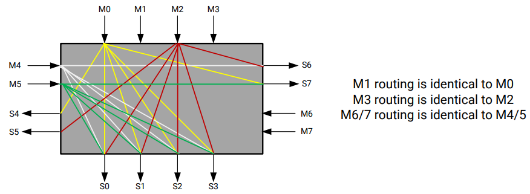

# Xilinx Alveo (U50) HLS HBM 使用

## 规格与结构

* 8GB HBM
* 32 个 HBM 伪通道 (Pseudo Channels/PC/bank)，每个 256MB (2Gb)
* 每个伪通道一个独立的 AXI 接口，伪通道和FPGA间通过分段交叉开关(segmented crossbar switch)做连接
* 每 2 个伪通道对应 一个 2 通道内存控制器(MC)
* 每个伪通道最大理论带宽为 14.375 GB/s
* 最大理论带宽为 460 GB/S (32 * 14.375 GB/s)，最大可实现的带宽420 GB/s (~ 90 % 效率)

下图中，从上到下，32对双向箭头为32个AXI接口，每个AXI接口对应一个HBM伪通道，白框为8个交叉开关，每个交叉开关2个内存控制器(MC)，每个内存控制器控制2个伪通道的HBM bank，每个bank 256MB (2Gb)。

下图为交叉开关路由示意图，交叉开关在内部M0→S0 (0-256MB)、M1->S1(256-512MB)是最快的，如果需要访问其他交叉开关的bank就需要多通过一个或多个左右开关路由从而增加延迟，并且当多个伪通道进行跨交叉开关访问时，交叉开关间的带宽可能饱和导致性能瓶颈。

## 测试

通常以64Byte(512b)为单位访问HBM比较合适。

